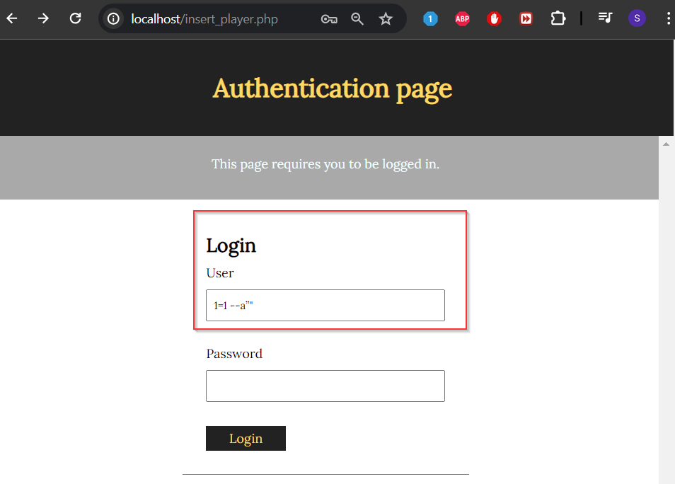

# Informe Pentesting Proyecto 8: Talent ScoutTech

# **Formulario de autorización de Pentesting**

**Cliente:** ACME

**Fecha de inicio del pentesting:** 09/05/2024

**Fecha de finalización del pentesting: 10**/05/2024

## Objetivo del Pentesting

Auditar la aplicación, sumergirse en el código y la configuración de la aplicación, aplicando vuestro conocimiento y habilidades/ técnicas para descubrir debilidades y proponer soluciones efectivas.

## Alcance

Los puntos que se seguirán en el alcance serán:

- Puntos de entrada para ataques: Se busca identificar posibles vulnerabilidades en la aplicación como puertas traseras o brechas de seguridad.
- Pruebas de seguridad web
    - Se evalúa la seguridad del proceso de autenticación, incluyendo la fortaleza de las contraseñas y la autenticación multifactor.
    - Se verifica que los controles de acceso sean adecuados para proteger la información de los usuarios.
- Seguridad de la base de datos
    - Se revisa la configuración de la base de datos en busca de vulnerabilidades como inyecciones SQL y accesos no autorizados.
    - Se evalúa la encriptación de datos y la gestión de claves para proteger la información confidencial
- Pruebas de seguridad de la AP:
    - Se evalúa la seguridad de la AP utilizada por la aplicación, incluyendo la autenticación de clientes y la protección contra ataques de tipo API.

## Duración

La prueba se debe se hacer en un plazo de 72 horas. La prueba puede realizarse durante ese periodo disponible.

## Acuerdo de Confidencialidad

La información proporcionada por la empresa “ACME” se considera confidencial y no debe ser compartida con terceros sin permiso previo de la empresa o por una orden judicial. Esto incluye datos técnicos, financieros, documentos y cualquier otra información  recopilada durante la investigación.

## Autorización del Pentesting

- Autorizo a Rafael Valverde Cros, a llevar a cabo pruebas de penetración en la página web en el ámbito de pentesting, según descrito en el objetivo.
- Autorizo a Rafael Valverde Cros a realizar todas las pruebas necesarios, siempre y cuando la integridad de la página web no se vea afectada.
- Autorizo a Rafael Valverde Cros a usar todas las herramientas que tengan disponibles para las pruebas.
- Autorizo a Rafael Valverde Cros a realizar pruebas que puedan generar positivos o alertas de seguridad en los sistemas de inicio de sesión.
- Autorizo a Rafael Valverde Cros a recopilar y analizar datos de la página web.
- Autorizo a Rafael Valverde Cros a utilizar los datos recopilados durante el pentesting únicamente con fines de evaluación de seguridad y para generar recomendaciones de mejora de seguridad
- Solicito a Rafael Valverde Cros a proporcionarme un informe detallado de los resultados del pentesting, incluyendo una descripción de las vulnerabilidades o riesgos de seguridad identificados, una evaluación de su gravedad y una recomendación de medidas de mitigación o corrección.
- Solicito a Rafael Valverde Cros a proporcionarme asistencia y asesoramiento en la implementación de las medidas de mitigación o corrección recomendadas.

## Permisos solicitados por los pentesters

Se solicita permiso de la empresa cliente para realizar un cambio en la página web una vez vulnerado para establecer la seguridad correctamente.

## Tarifas y pagos

La empresa aceptará desembolsar el pago por el servicio recibdio, en un acuerdo financiero donde se especificará todas las tarifas asociadas que deberá presentarse junto con este documento y firmado al mismo tiempo.

Firma del cliente: “ACME”

Fecha: 09/04/2024

## Índices de gravedad de los hallazgos

Los resultados presentados en las tablas son el producto de análisis de vulnerabilidades realizados en los objetivos dados de la empresa. Estos análisis han revelado una diversidad de vulnerabilidades que abarcan diferentes niveles de riesgo y criticidad.

| Riesgo | Página Web |
| --- | --- |
| Crítico | 1 |
| Alto | 2 |
| Medio | 1 |
| Bajo |  |

## Factores de riesgos

Los factores de riesgo de CVSS, aplicados a los hallazgos de vulnerabilidades nos ofrecen una visión detallada de la criticidad de cada vulnerabilidad, desde aquellas con impacto limitado hasta aquellas con consecuencia devastadoras,

| Nivel de Criticidad | Puntuaciones | Descripción de la Criticidad |
| --- | --- | --- |
| Bajo | 0.0 - 3.9 | Vulnerabilidades con impacto limitado o que requieren condiciones poco probables para ser explotadas. |
| Medio | 4.0 - 6.9 | Vulnerabilidades con un impacto moderado que pueden ser explotadas bajo ciertas condiciones. |
| Alto | 7.0 - 8.9 | Vulnerabilidades con un impacto significativo y que pueden ser fácilmente explotadas. |
| Crítico | 9.0 - 10.0 | Vulnerabilidades con un impacto devastador y que pueden ser explotadas de manera trivial o sin requerir autenticación. |

# Resultados técnicos

## Inyección SQL

| Descripción | El producto construye todo o parte de un comando SQL utilizando entradas incluencidas exterenamente de un componente aguas arriba, pero no neutraliza o neutraliza incorrectamente los elementos especiales que podrían modificar el comando SQL previsto cuando se envía a un componente aguas abajo. |
| --- | --- |
| CVSS v3.0 | 8.6 |
| CVE/CWE | https://cwe.mitre.org/data/definitions/89 & https://nvd.nist.gov/vuln/detail/CVE-2023-37197 |
| Riesgos | Alto |
| Impacto | Puede permitir al atacante acceder, modificar o eliminar datos confidenciales de la base de datos subyacente de una aplicación. Esto puede llevar a la divulgación de información confidencial, pérdida de integridad de datos e incluso ejecución de comandos maliciosos en el servidor de la aplicación |
| Sistemas | Página Web, en cualquier Login  |
| Remediación | Es utilizar consultas parametrizadas. Al utilizar este método de consulta de la base de datos, cualquier valor proporcionado por el cliente se manejará como un valor de cadena en lugar de como parte de la consulta SQL. |
| Referencias | https://www.tenable.com/plugins/was/98115 |
| Prueba de Concepto |   |

## Fuerza Bruta a Login

| Descripción | Existe una vulnerabilidad de restricción inadecuada de intentos de autenticación excesivos que podría mprovocar la apropiación de cuentas y el acceso no autorizado al sistema cuando un atacante realiza ataques de fuerza bruta contra el formulario de inicio de sesión  |
| --- | --- |
| CVSS v3.0 | 9.8 |
| CVE/CWE | CVE: https://www.incibe.es/incibe-cert/alerta-temprana/vulnerabilidades/cve-2024-2051 & CWE: https://cwe.mitre.org/data/definitions/307.html |
| Riesgos | Crítico |
| Impacto | Acceso no autorizado a datos sensibles, compromiso de la integridad de los datos, violación de la privacidad, daño a la reputación…. |
| Sistemas | Página Web, en cualquier Login  |
| Remediación | Es fundamental implementar controles de seguridad robustos, como políticas de contraseñas seguras, bloqueo de cuentas después de un número determinado de intentos fallidos… Además, es esencial mantenerse actualizado sobre las mejores prácticas de seguridad y realizar pruebas de penetración regulares. |
| Referencias | https://www.tenable.com/cve/CVE-2024-2051 |
| Prueba de Concepto |  |

## Improper Neutralization of Input During Web Page Generation (’Cross-site Scripting’)

| Descripción | Existe una vulnerabilidad CWE-79 inadecuada de la entrada durante la generación de páginas web que podría comprometer el navegador de un usuario cuando un atacante con privilegios de administrador ha modificado los valores del sistema |
| --- | --- |
| CVSS v3.0 | 4.8 |
| CVE/CWE | CVE: https://www.incibe.es/incibe-cert/alerta-temprana/vulnerabilidades/cve-2023-5985 & CWE: https://cwe.mitre.org/data/definitions/79.html |
| Riesgos | Medio |
| Impacto | Compromisos de la integridad y confidencialidad de los datos del usuario, phishing, daño a la reputación, impacto a la disponibilidad del servicio… |
| Sistemas | Página Web, en los comentarios de los jugadores  |
| Remediación | Validación y escape de entrada, uso de encabezados de seguridad, filtrado de salida, sanitazación de HTML, educación y concienciación, pruebas de seguridad… |
| Referencias | https://www.tenable.com/cve/CVE-2023-5985 |
| Prueba de Concepto |  |

## Cross-Site Request Forgery (CSRF)

| Descripción | Induce a los usuarios a realizar acciones no deseadas, lo que llevaría a la anulación de las configuraciones del sistema cuando un atacante persuade a un usuario para visitar un sitio web no autorizado |
| --- | --- |
| CVSS v3.0 | 8.8 |
| CVE/CWE | CVE: https://nvd.nist.gov/vuln/detail/CVE-2022-22811 & CWE: https://cwe.mitre.org/data/definitions/352.html |
| Riesgos | Alto |
| Impacto | Realización de acciones no deseadas, compromiso en la seguridad y privacidad, daño a la reputación, violación de la integridad de datos… |
| Sistemas | Página Web, en los comentarios de los jugadores  |
| Remediación | Token CSRF, SameSite Cookies, encabezados de solicitud HTTP, verificación de la solicitud, protección basada en el tiempo, educación del usuario… |
| Referencias | https://www.tenable.com/cve/CVE-2022-22811 |
| Prueba de Concepto |  |

